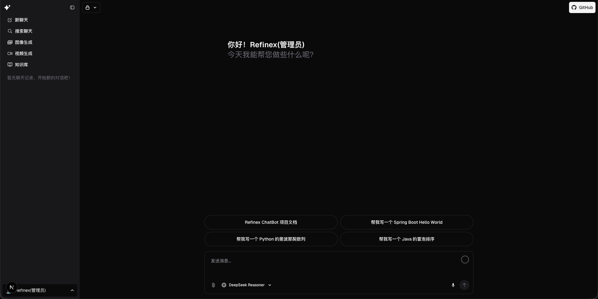

<a href="https://github.com/refinex-lab/Refinex-ChatBot">
  
  <h1 align="center">Refinex ChatBot</h1>
</a>

<p align="center">
  基于 Spring AI + Spring Cloud + Next.js 15 的一站式智能体与知识库解决方案
</p>
<p align="center">
  <a href="https://github.com/refinex-lab/Refinex-ChatBot">GitHub</a> ·
  <a href="#主要特性">主要特性</a> ·
  <a href="#模块总览">模块总览</a> ·
  <a href="#快速开始">快速开始</a> ·
  <a href="#模块亮点">模块亮点</a> ·
  <a href="#配置--环境变量">配置</a>
</p>
<br/>

## 主要特性

- **全栈一体化**：Spring Boot 3.5 + Spring Cloud 2025 微服务，配合 Next.js 15 App Router 前端，覆盖 Chat UI、门户、网关、AI 能力与知识库。
- **可插拔 AI 能力**：Spring AI 驱动的提示词与模型抽象，预置模型/向量库/工具等枚举，便于扩展 xAI、OpenAI、DeepSeek、阿里通义等多提供方。
- **企业级账号体系**：Sa-Token + Redis + AES/HMAC 敏感信息加密，提供登录/注册、验证码、角色权限下发、登录审计等能力。
- **文件与存储编排**：统一文件 API，支持本地、数据库、S3 兼容存储，内建断点续传、图片压缩、SHA-256 校验与多租用业务打标。
- **知识库底座**：抽象知识库、目录、文档版本、分片元数据与入库任务实体，预埋 RAG 策略、向量库类型等枚举，方便构建检索增强与智能问答。
- **网关与可观测性**：Spring Cloud Gateway + Knife4j 聚合文档、Same-Token 内部鉴权、防重放 DataSign、TraceId 贯通链路、请求日志持久化。
- **开发体验**：JDK 21 虚拟线程、Nacos 配置/注册、Redisson、Lock4j、MapStruct、Drizzle ORM、Vercel AI SDK、Playwright e2e 测试等现代化脚手架。

## 模块总览

| 模块 | 说明 |
| --- | --- |
| `refinex-common` | 自研基础库，提供 `refinex-core`(API/异常/日志/AES/HMAC)、`refinex-json`、`refinex-redis`、`refinex-jdbc`、`refinex-satoken` 等能力。
| `refinex-platform` | 统一账号与资产中心：登录、注册、角色/权限、验证码、用户中心、文件及存储配置、登录审计等服务，默认 8082 端口。
| `refinex-ai` | 智能体域：Spring AI Prompt 管理、模板格式化、提示词版本 hash、后续模型会话/工具调用的枚举与骨架，默认 8083。
| `refinex-kb` | 知识库域：知识库、目录、文档版本、分片、入库任务实体与枚举，为 RAG/索引服务打底，默认 8084。
| `refinex-gateway` | Spring Cloud Gateway(8081)：路由编排、黑名单、ForwardAuth Same-Token、跨域、TraceContext、Knife4j 聚合。
| `chatbot-ui` | Next.js 15 + Vercel AI SDK 前端，兼容 Vercel AI Gateway、Neon Postgres、Vercel Blob/Redis，封装业务 API 前缀。
| `document` | 开发资料：`images/readme-cover.png`、`nacos/dev/*.yaml`、`sql/mysql/table.sql`、`日志管理.md` 等文档。

## 技术栈

- **后端**：Spring Boot 3.5.6、Spring Cloud 2025.0.0、Spring Cloud Alibaba 2023.0.3.3、Spring AI 1.0.3、Sa-Token 1.44、MyBatis-Plus、MapStruct、Redisson 3.51、Lock4j、RocketMQ-Spring、Easy-ES、Knife4j。
- **前端**：Next.js 15 (App Router + RSC)、React 19 RC、TypeScript 5.6、Vercel AI SDK、Drizzle ORM、shadcn/ui、Tailwind CSS 4、Radix UI、Vercel Blob、Redis、Embla、Playwright、Biome。
- **基础设施**：MySQL 8、Redis 7、Nacos 2.5、Neon/Serverless Postgres、对象存储(S3/本地/DB)、Vercel AI Gateway、DeepSeek/OpenAI/xAI 模型、RocketMQ、向量库(Easy-ES/TBD)。

## 项目结构

```text
Refinex-ChatBot/
├── chatbot-ui/                # Next.js AI 前端
├── refinex-common/            # 公共库 (core/json/jdbc/redis/satoken)
├── refinex-platform/          # 账号、文件、权限、验证码等服务
├── refinex-ai/                # Prompt & AI 服务
├── refinex-kb/                # 知识库域服务
├── refinex-gateway/           # Spring Cloud Gateway
├── document/
│   ├── images/readme-cover.png
│   ├── nacos/dev/*.yaml       # Nacos 配置样例
│   ├── sql/mysql/table.sql    # 初始化表结构
│   └── 日志管理.md
├── bootstrap.yml              # Nacos 连接示例(按需覆盖)
├── pom.xml / package.json / pnpm-lock.yaml
└── node_modules, logs, hs_err_*.log 等开发产物
```

## 环境准备

1. **JDK 21+**，建议使用 GraalVM CE/Temurin，确保 `JAVA_HOME` 配置完毕。
2. **Maven 3.9+**，用于构建多模块 Spring Boot 服务。
3. **Node.js 20+ 与 pnpm 9+**，运行 Next.js 前端（仓库内 `packageManager` 已绑定 `pnpm@9.12.3`）。
4. **MySQL 8.x**：初始化 `refinex_chatbot` 库并执行 `document/sql/mysql/table.sql`。
5. **Redis 7.x**：用于会话、验证码、缓存与分布式锁。
6. **Nacos 2.5+**：导入 `document/nacos/dev` 目录下 YAML，或根据自身环境拆分为多个配置集。
7. 可选：Vercel AI Gateway、Vercel Blob、Neon Postgres、S3 兼容存储、RocketMQ、向量数据库等。

## 快速开始

### 1. 初始化数据库

```bash
mysql -uroot -p < document/sql/mysql/table.sql
```

- 默认建库名称 `refinex_chatbot`，内置 `refinex/refinex` 管理员账号（密码为 BCrypt 哈希，请按需重设）。
- 表字段对敏感信息使用 AES-GCM 密文列 + HMAC 索引列，生产环境务必更换 `refinex.logging` 中的 `aes-key` 与 `hmac-key`。

### 2. 导入配置中心

1. 登录 Nacos，新建 `dev` namespace 与 `Refinex-ChatBot` 分组（与 `bootstrap.yml` 保持一致）。
2. 依次导入 `document/nacos/dev` 内的：
   - `application.yml`（全局共享配置）
   - `application-servlet.yaml`（仅 Servlet 服务：数据源、文件上传、MVC）
   - `refinex-platform.yaml`、`refinex-ai.yaml`、`refinex-kb.yaml`、`refinex-gateway.yaml`
3. 若不使用 Nacos，可将内容拷贝到各模块 `application-*.yml`，并在 `bootstrap.yml` 中关闭 `spring.config.import`。

### 3. 启动后端服务

```bash
# 安装依赖
mvn -pl refinex-common -am install

# 按需在独立终端启动各服务（默认端口：Gateway 8081 / Platform 8082 / AI 8083 / KB 8084）
mvn -pl refinex-platform spring-boot:run
mvn -pl refinex-ai spring-boot:run
mvn -pl refinex-kb spring-boot:run
mvn -pl refinex-gateway spring-boot:run
```

- `bootstrap.yml` 中 `nacos.server-addr/namespace/group` 仅为示例，请通过环境变量或启动参数覆盖：
  `mvn spring-boot:run -Dspring-boot.run.arguments="--nacos.server-addr=127.0.0.1:8848 --nacos.namespace=dev"`
- 启动后访问 `http://localhost:8081/doc.html` 可查看 Knife4j 聚合接口文档。

### 4. 启动前端 (chatbot-ui)

```bash
cd chatbot-ui
cp .env.example .env.local  # 根据需要填写密钥
pnpm install
pnpm db:migrate             # 初始化 Drizzle Schema (Neon/Postgres)
pnpm dev                    # 默认运行在 http://localhost:3000
```

关键环境变量说明（全部定义在 `.env.example`）：

- `AI_GATEWAY_API_KEY`：Vercel AI Gateway Key，非 Vercel 部署必填。
- `BASE_URL` / `NEXT_PUBLIC_BASE_URL`：指向 Gateway（默认 `http://localhost:8081/`）。
- `BASE_URL_PREFIX_*`：与 Gateway `Path` 保持一致（`refinex-platform`、`refinex-ai`、`refinex-kb`）。
- `BLOB_READ_WRITE_TOKEN`、`POSTGRES_URL`、`REDIS_URL`：分别对应 Vercel Blob、Postgres、Redis。
- `DEEPSEEK_API_KEY` 等模型密钥：可替换为任意 AI Provider。

前端会自动携带 `DataSign`、`X-Trace-Id` 与 `Authorization` Cookie（Sa-Token），从而复用后端链路追踪与权限体系。

## 模块亮点

### Refinex Platform（账号 & 文件 & 权限）

- `AuthController` 提供登录、登出、注册、`/auth/me`、`/auth/roles/{userId}`、`/auth/permissions/{userId}` 等接口，基于 Sa-Token 多端会话 + 自定义 `LoginHelper`。
- `CaptchaController` 支持多种验证码（静态/GIF/算术/中文），是否启用由 `refinex.captcha.enabled` 控制。
- `UserController` 覆盖个人信息、头像、密码修改，`@RequestLog` 自动审计。
- `FileController` 支持简单上传、下载、删除 + 分片上传（initiate/upload/complete/abort），同时支持图片压缩、SHA256 校验、业务打标；`StorageConfigController` 用于配置多存储（DB/本地/S3）。
- `LoginEventListener` 捕获 Sa-Token 登录事件，将 IP/UA/设备写入 `sys_login_log`；`LoginAuditService` 可扩展风控。
- `document/sql/mysql/table.sql` 覆盖用户、角色、菜单、操作、角色关联、文件、请求日志等 30+ 张表，预置 AES/HMAC 字段与索引，开箱即用。

### Refinex AI（Prompt & 模型编排）

- `AiPromptController` 提供 `/ai/prompts` CRUD、按 ID/编码查询、分页搜索并支持分类/模板格式/关键词过滤。
- `AiPromptServiceImpl` 对提示词生成 SHA-256 hash、防重复、JSON 序列化变量/示例、登录用户隔离、`JdbcTemplateManager` 事务写入。
- `enums/*` 描述模型类型、提供方、工具类型、RAG 策略、MCP Transport、向量相似度、工具选择策略等，便于后续扩展 Chat Completion、Tool Call、函数编排。
- 结合 Spring AI PromptTemplate（`PromptTemplateFormat`）可快速将通用模板转换为 `spring`、`json`、`chatml` 等格式，支撑多模型切换。

### Refinex KB（知识库底座）

- `KbBase`、`KbCatalog`、`KbDocument`、`KbDocumentVersion`、`KbChunkMeta`、`KbIngestJob` 等实体涵盖知识库生命周期（来源、语种、版本、分片、向量集合、任务状态）。
- `KbIngestJob` 预设 `PENDING/RUNNING/DONE/FAILED` 状态、`INGEST/REINDEX/DELETE/REFRESH` 类型及进度字段，方便落地异步流水线。
- `VectorStoreType`/`VectorMetric`/`RagStrategy`/`BizType` 等枚举，为 Faiss、Milvus、Elastic、OpenSearch、PGVector 等向量引擎或 Retrieval 策略留好拓展空间。

### Chatbot UI（Next.js 15 模板）

- 延续 Vercel 官方 Chat SDK 体验，App Router + React Server Components + Server Actions，提供聊天窗口、模型配置、文件上传、消息对比等组件。
- 集成 `@ai-sdk/gateway`、`@ai-sdk/openai`、`@ai-sdk/xai`，可在前端数行代码切换模型；同时支持 `DeepSeek` API Key。
- 使用 Drizzle ORM + Neon Serverless Postgres 存储聊天记录，Vercel Blob/Redis 处理文件和会话状态；`pnpm db:*` 脚本覆盖常见 Schema 操作。
- `.env.example` 已添加 Refinex 后端网关/模块前缀、Sa-Token Cookie 名、DataSign 头同步，便于联调。

### Gateway & Common Libraries

- `refinex-gateway` 基于 Spring Cloud Gateway WebFlux，包含 `ForwardAuthFilter` 自动注入 Same-Token、`TraceContextWebFilter`、`BlackListUrlFilter`、`WebCorsFilter`、`WebCacheRequestFilter`、`GlobalLogFilter` 等。
- 路由规则在 `document/nacos/dev/refinex-gateway.yaml` 中集中管理，默认 `/refinex-platform/**` 等路径 Strip 前缀后转发到对应服务。
- `refinex-common`：
  - `refinex-core` 提供 `ApiResponse/PageResponse`、统一异常、`@RequestLog` + `TraceLoggingFilter`、`TraceContextHolder`、`BusinessException`、AES/HMAC/签名工具、`TracePropagationRequestInterceptor`。
  - `refinex-json` 封装 Jackson `JsonUtils`；`refinex-redis` 提供 Redisson 客户端/布隆过滤器/分布式锁；`refinex-jdbc` 内建 `BaseEntity`、`JdbcTemplateManager`、分页工具。
  - `refinex-satoken`（common/servlet/reactor）封装 `LoginHelper`、`TokenConstants`、自定义异常、Same-Token 配置，供微服务与网关复用。

## 日志与可观测性

- 参考 `document/日志管理.md`：前端若未携带 `DataSign` 会由网关补齐，并生成 `X-Trace-Id`，全链路通过 MDC + Header 透传。
- `refinex.logging.request-log` 可配置是否记录请求/响应体、忽略路径、敏感字段掩码，并可落表 `sys_request_log`（结构见 `document/sql/mysql/table.sql`）。
- 各服务 `logback-spring.xml` 将日志输出到 `./logs/{service}/info.log|error.log`，格式统一。
- Knife4j 聚合接口文档地址 `http://{gateway}/doc.html`，OpenAPI `http://{service}/v3/api-docs` 由网关自动发现。

## 配置 & 环境变量

- `bootstrap.yml` 仅示例如何连到 Nacos，请通过环境变量或外部化配置覆盖敏感信息（例如 `nacos.password`）。
- `document/nacos/dev/application.yml` 含 Redis、虚拟线程、Feign、Sa-Token、Redisson、Lock4j、Trace/Logging 配置，生产环境请调优并替换密钥。
- `document/nacos/dev/application-servlet.yaml` 持有数据源与上传限制，需要根据实际 MySQL/连接池参数调整。
- `document/nacos/dev/refinex-platform.yaml` 控制验证码开关、登录策略（最大失败次数、锁定时长等）。
- 前端 `.env.local` 应避免提交，推荐使用 Vercel 环境变量或本地密钥管理；禁用游客模式可设置 `NEXT_PUBLIC_REQUIRE_LOGIN=true`。

## 常见问题

1. **Nacos 配置未生效？** 确认 `bootstrap.yml` 中的 `namespace/group` 与 Nacos 控制台一致，或在启动参数中传入 `--spring.profiles.active`、`--nacos.*` 覆盖。
2. **前端报错找不到 API？** 核对 `.env.local` 的 `BASE_URL` 与 `BASE_URL_PREFIX_*` 是否指向 Gateway，并确保 Gateway 白名单允许需要的未登录接口。
3. **文件上传失败？** 检查 `refinex-platform` 所使用的存储配置：`refinex_platform.sys_storage_config` 需存在默认存储，且 S3/本地路径具备访问权限；开启分片上传时需保持 `uploadId` 有效。
4. **TraceId 无法串联？** 确认客户端请求带上 `DataSign`（或由 Gateway 自动注入）、后端未覆盖默认 `refinex.logging.trace-id-header`，并检查日志里是否存在 MDC 输出。

## 路线图

- ✅ Prompt 管理 / 认证 / 文件中心 / 网关 / 日志追踪基座。
- 🚧 AI 对话、工具编排、会话上下文、多模型策略、RAG 流水线、向量存储接入、知识库 UI、租户化与计费。
- 📌 欢迎通过 Issue/PR 贡献想法：模型适配、数据清洗、Agent 工作流、插件体系、部署脚本等。

## 贡献 & 协议

- Issue / PR 欢迎同步到 [refinex-lab/Refinex-ChatBot](https://github.com/refinex-lab/Refinex-ChatBot)。建议先讨论再提交代码，以便统一规范。
- 提交代码前请运行 `mvn verify` 及 `pnpm lint`/`pnpm test` 确保质量；必要时补充单元测试或 Playwright 场景。
- 本项目基于 [Apache License 2.0](LICENSE) 开源，使用与分发请遵守协议条款。
